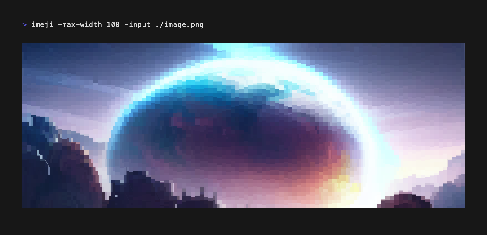

# imeji

イメジ ー Images for the terminal



[](https://pkg.go.dev/github.com/BigJk/imeji)

imeji is a lightweight alternative to the awesome [chafa](https://hpjansson.org/chafa/). It is written in go and can be easily embedded into tools. imeji takes a image as input and creates a sequence of characters and ansi color sequences resulting in a terminal printable images.

### Why not use chafa?

If you can install chafa it should be preferred, as it is more advanced, faster and just awesome! But if you want to include terminal image output in your go application and don't want to ship chafa as external dependency imeji might be worth a try.

# CLI

```
イメジ :: Images for the terminal ー by BigJk
 _                 _ _
(_)_ __ ___   ___ (_|_)
| | '_ ` _ \ / _ \| | |
| | | | | | |  __/| | |
|_|_| |_| |_|\___|/ |_|
                |__/
_________________________________________

  -font-scale float
    	vertical font scaling value (default: 0.8)
  -force-full-color
    	forces full color output
  -help
    	print help
  -input string
    	input image path
  -max-width int
    	sets the max width of the output (in cells) and keeps the aspect ratio
  -size string
    	size in terminal cells (e.g. 100x20)
  -symbols string
    	which symbole sets to use (blocks, blocks_simple, blocks_adv, ascii, misc) (default "blocks")
```

### Install ``imeji`` command

```
go install github.com/BigJk/imeji/cmd/imeji@latest
```

# Go Library

```
go get github.com/BigJk/imeji
```

### Example

```go
// Print directly to stdout and detect terminal capabilities:
imeji.File(os.Stdout, "./image.png", imeji.WithMaxWidth(100))

// Convert to string with full color support:
text, _ := imeji.FileString("./image.png", imeji.WithTrueColor())
fmt.Println(text)
```